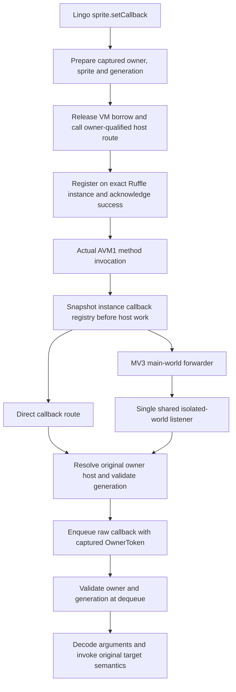

# Historical implementation and diagnostic record

Superseded progress notes; final acceptance is in README.md and acceptance.json.

# Stage 2.7 callback-origin component

Status: implementation and integration in progress. This is not an accepted
runtime checkpoint. The preceding component is
[accepted separately](../score-child-pointer-20260917/README.md).

Current runtime status: initial string-path registration and the authored AVM1
wrapper execute after the scheduler, evaluator and receiver-name repairs. The
fixture's getVariable object result returns Void because the runner's bridge
transport converts object values to null. The fixture will obtain `_root` as a
real callback-delivered retained object and reuse it for ready-cache registration
and property/stale checks. Bridge object returns remain a separate limitation;
the earlier nested-expression diagnosis is superseded. Temporary instrumentation
must be removed before acceptance.
Earlier C3 native 607/607 and production WASM success do not validate the later
scheduler repair or callback delivery. Detailed receipts and superseded attempts
are recorded below.

The gpt-5.6-sol/high lead coordinates two gpt-5.6-luna/high pilots with exclusive
Ruffle and VM/frontend ownership. The navigator owns final acceptance and these
status documents. Source edits, caches and receipts remain in the repository
or `~/Projects`.

## Approved flow

Registration always uses the pending boundary, including ready-cache hits.
LocalConnection bookkeeping retains its original insertion timing during
validated preparation. Missing registration acknowledgement is an error in
both direct and bridge modes. Delivery never attaches current metadata to an
old callback and never chooses the last installed browser handle.

The bridge carries the original owner/sprite/generation unchanged. Its shared
listener must deliver once per event and remain usable by owner B after owner A
is disposed. This is a callback-only extension; no LocalConnection protocol
redesign is included.

## Evidence so far

- The nine-file preserved Ruffle proposal matched its before-hashes before
  integration. The pre-existing seven Ruffle edits were preserved.
- Ruffle core tests pass 113/0, including four registry tests.
- Actual Ruffle web/WASM/selfhosted build passes. Navigator verified all seven
  copied files against the lead's artifact manifest.
- The VM/frontend registration and delivery changes still need coherent
  compilation and runtime validation. No callback browser pass is claimed.

Navigator review found an initial-registration race: the generation must be
captured before emitting host actions, then checked again after reentry. The
lead is also reviewing embedded FlashObjectRef owner/sprite/generation validation,
metadata capture before readiness, and preservation of the short-arity no-op.
These repairs and the real AVM1 fixture remain in progress under the VM pilot.

The preliminary native compile passes, but its source is superseded by review
repairs. Direct callback delivery still had a per-initialization closure tied to
the last host, while the shared DOM listener used a different decoding path.
The lead is replacing both with a stable common route. Argument wire decoding
must also respect the dequeue-time origin fence; its exact encoding boundary
is under review before final runtime checks.

The approved encoding boundary now keeps the existing public PlainJson callback
method and adds a separate Ruffle receiver carrying untouched base64-array JSON.
Both direct and DOM routes use the same stable owner-table lookup. The raw VM
command distinguishes encodings and decodes only after dequeue origin validation;
LocalConnection remains unchanged. Preserve per-element string fallback and
verify UTF-8, numeric and object arguments before accepting the decoder.

The lead transferred exclusive authored SWF generator/validator/provenance
ownership to the completed Ruffle pilot (gpt-5.6-luna/high). The core pilot keeps
production repairs and Rust/browser wrapper integration. This parallel split
does not reopen the frozen Ruffle source or require a Ruffle rebuild.

Fixture review found that the host CallFunction happy path invokes the function
value directly and bypasses the callback hook in AVM1 Object::call_method. The
fixture therefore needs an authored wrapper whose ActionCallMethod invokes the
registered probe. Its independent validator must check that action and stack
sequence; the probe records invocation count and arguments as positive controls.

C1 production freeze compiles natively. Navigator reviewed the repaired
generation capture/revalidation, embedded object binding checks, shared no-decode
route and dequeue-time decoder without finding another architecture blocker.
Receipt: `stage2-7/validation/c1-native-compile.log`; source manifest:
`stage2-7/validation/c1-source-freeze.sha256`. Actual browser behavior remains
pending. The corrected authored wrapper passes generation and independent
structural validation; its initial hash is
`8f736a5bc66db986f02c4e8c0b3aee9f91f6d8abd78b4217ea2d32a3b0f05fd5`.
Focused tests exposed incorrect Unicode test encoding and incomplete host
publication in a registration unit fixture; those test repairs are in progress.

Those fixture repairs now pass: decoder 3/3, frontend direct/bridge ownership
12/12, and full native 601/601. Registration coverage still needed short-arity,
native unsupported-host and embedded-object rejection cases; the lead assigned
a bounded test-only batch plus an initial string-path browser registration
positive control alongside the already-ready FlashObject case. Final test/WASM/
browser evidence remains pending; the 601-test receipt is an intermediate gate.

The first C2 WASM release attempt failed with 26 errors in the new browser
helper (nested Results, temporary borrows and one moved Symbol). Native cfg did
not compile that helper. It is part of the WASM library cfg, so its test edits
also affect the production artifact; the lead will wait for its repaired freeze
before rebuilding. Failed receipt: `stage2-7/validation/c2-production-wasm-release.log`.
No artifact or browser success is claimed for that attempt.

The final native source gate passes registration 4/4, valid-queued-then-stale
predecode rejection 1/1, and the full library suite 606/606. The synchronous
fallback now rejects before metadata/LC side effects. WASM helper compiler
repairs are complete; the release retry is linking under the lead's sole
monitoring ownership. Actual browser callback execution remains the next gate.

Navigator subsequently found retained callback object markers were converted
with cast metadata only, producing unbound FlashObjectRef values. Approved
repair: an internal optional RawFlashBinding carries captured owner/sprite/
generation recursively through owned callback argument conversion, constructed
after the dequeue fence. PlainJson and Ruffle-encoded owned callbacks receive
that binding; the LocalConnection decoder keeps its existing unbound path.
Acceptance must read an actual returned object's property through the owned
Flash route, then reject that retained object after replacement while B survives.
Native recursive-marker and LC compatibility checks accompany this change.
This supersedes the preceding production freeze; no Ruffle rebuild is needed.

The first focused callback browser attempt failed before any test marker: the
test page template lacked the new dirplayer_registerLingoCallbackOwned export.
The lead stopped the run after that decisive page error (exit 130); receipt:
`stage2-7/validation/c2-browser-callback-focused.log`. Production-matching
template exports are being repaired in the same freeze as RawFlashBinding.
This is an import failure, not a callback runtime result.

C3 includes the retained-object binding and template repairs. Raw callback
tests pass 5/5, full native library tests pass 607/607, and production WASM
release passes in 1m43s. Navigator inspected the completed native/release
receipts and the captured-binding conversion. Receipts:
`stage2-7/validation/c3-native-full-final.log` and
`stage2-7/validation/c3-production-wasm-release-final.log`. The lead is running
the focused actual callback browser gate; no pass is claimed yet.

C3 focused browser reaches real Ruffle startup for two distinct owners, then
fails with a borrow panic through drive_pending_owner/run_command_loop and a
subsequent wasm-bindgen-futures RefCell panic. The lead is tracing the earliest
failure and distinguishing manual fixture pumping from production scheduling
before proposing any repair. Receipt:
`stage2-7/validation/c3-browser-callback-focused.log`. This is a runtime failure;
the callback component remains unaccepted despite native/build success.

Follow-up identifies allocation failure before the reported borrow panic. The
proposed one-evaluator/one-action scheduler cap was not approved: queues remove
or mark requests started before awaiting, and nested same-class work is an
intentional dependency path. The lead will run bounded diagnostic-only queue/
work/identity counters and fixture phase markers to establish the cause. Any
diagnostic abort threshold must be removed or test-gated before acceptance;
no class-wide production scheduling cap is authorized from this hypothesis.

The first diagnostic attempt used cfg(test) inside the library, which is not
enabled when Cargo integration tests link that library. Navigator identified
this gate mismatch; the lead stopped the run before treating absent counters
as evidence. The replacement is an explicit diagnostic-only source/artifact
freeze with the patch retained and mandatory removal/rebuild before acceptance.

The explicit diagnostic artifact shows work growing 1/2/4/8/16/32/64/128 while
the same EvalId serial 1 remains queued, with no inflight evaluator or pending
command. Future states are finite (9,448-byte Eval; 10,112-byte Actions).
Receipt: `stage2-7/validation/c3-browser-callback-scheduler-diagnostic-final.log`.
The lead now has approval for a bounded biased-select experiment: poll real
work before the fallback timer in both scheduler loops, preserving nested
same-class concurrency. Require bounded work and actual callback progress,
remove diagnostics, then verify scheduling and integrated browser regressions.
This is an experiment approval, not scheduler or callback acceptance.

Biased selection did not fix growth; the same queued identity again reached
128 (`c3-browser-callback-biased-diagnostic.log`). That experiment is superseded
and must be reverted. Approved next repair synchronously claims each EvalId or
ready action ticket before boxing its execution future, extracting helpers that
consume the captured request. Session cancellation metadata remains retained,
host work stays outside VM borrows, and distinct nested requests remain
concurrent. Regression must leave an admitted future unpolled and prove the
same identity cannot be readmitted while a distinct request still can. Callback
runtime and final diagnostic-free validation remain required.

Admission-gap review also requires same-owner caller cancellation coverage:
an action claimed but not yet polled must revalidate its exact ticket before
host effects, even when the player owner is still live. Late completion rejection
alone does not prevent a cancelled action from performing host work.

The identity-admission native regression passes 1/1, including same-owner
caller cancellation before first poll and normal completion. First-poll action
validation checks the registered capability ticket and the matching started
command/action before host execution; navigator reviewed that boundary. Receipt:
`stage2-7/validation/c4-scheduler-admission-native-focused4.log`. The lead is
building/running the bounded diagnostic browser confirmation; diagnostics remain
temporary and the component remains unaccepted.

The corrected admission-count diagnostic repeats exact EvalId serial1 and
EvalAction serial2 (ordinary Object request) through its bounded 1,024 admissions.
Source confirms existing_reason alone makes the fallback requeue the same
ordinary Object without dispatch. Removing that reason-only retention is
approved; preserve the reason when a real typed Pending is returned. Navigator
also identified the subsequent missing typed SpriteAsync evaluator result/
execution route. The lead must preserve attached-script precedence and propose
the minimal out-of-borrow typed completion path before the next browser build.
Require initial string setCallback through the real evaluator to reach explicit
native unsupported-host handling, covering both dispatch hops.

Corrected dispatch proposal approved: shared Unsupported datum dispatch reuses
classify_async_object to produce the checked typed request; ordinary Object
fallback no longer retains solely because a reason exists. An explicit
EvalRequestTurn::SpriteAsync is returned only after attached-script lookup, then
executed outside the borrow by both scheduler and direct evaluator drivers.
Central typed resume validation preserves original owner/player/action authority.
Do not intercept SpriteAsync before attached-script resolution. Require bounded
full-evaluator native unsupported handling, attached-script precedence, and the
existing generic/JS object regression gates because shared fallback changes.

C5 native focused gates pass real-evaluator unsupported registration 1/1,
attached-script precedence 1/1 and scheduler admission/cancellation 1/1. Its
actual browser diagnostic gets past the former loop and starts both ready Ruffle
instances, then fails A registration acknowledgement (0/1). Receipt:
`stage2-7/validation/c5-browser-callback-typed-route-diagnostic.log`. The frontend
must call exposed receiver dirplayer_register_lingo_callback, not the internal
camel-case WASM method. The lead is correcting manager/mocks for direct and bridge
paths; no Ruffle rebuild is needed. Full callback delivery remains unverified.

Later diagnostic6 reaches strict registration acknowledgement and both Ruffle
instances become ready, but the Lingo callback count remains zero after the
host wrapper call returns. Receipt:
`stage2-7/validation/c5-browser-callback-typed-route-diagnostic6.log`.
The lead identified authored AVM1 stack errors: named DefineFunction does not
push the function value consumed by SetMember, and CallMethod arguments were
pushed in the wrong order. A fixture-only repair is in progress, with independent
validator checks and an authored invocation-count assertion before the Lingo
delivery wait. Earlier structural fixture validation did not prove these stack
semantics. Production/Ruffle source remains frozen during this repair.

C6 repaired the SWF member assignment and argument stack, but the new authored
invocation-count check remained zero. The fixture supplied an unqualified
`dirplayerInvokeCallbackProbe` name; this fork's host call path requires a dotted
path. The lead is correcting all positive fixture calls to
`_root.dirplayerInvokeCallbackProbe`. Returning from the earlier host call did
not establish authored execution or callback transport. The failed C6 receipt
is retained under the validation directory.

C7 uses the qualified path but still observes inner invocation count zero.
This does not distinguish an unentered wrapper from a failed inner CallMethod.
One further fixture-only discriminator is approved: record wrapper-entry count,
then check inner invocation count, then Lingo delivery. Before rebuilding, the
pilots must trace the full authored stack against this fork and independently
review it. A failed discriminator without a concrete cause requires a revised
fixture approach; it does not authorize speculative Ruffle changes or weaker
acceptance.

C8's wrapper-entry discriminator stays zero after strict registration and
readiness, so neither the inner authored call nor callback transport is reached.
Receipt: `stage2-7/validation/c8-browser-callback-wrapper-discriminator.log`;
source freeze: `c8-diagnostic-source-freeze.sha256`. Both pilots reviewed the
anonymous-function stack. One alternative is approved: named DefineFunction on
the root timeline with no SetMember, using this fork's target-scope definition
semantics. All wrapper, inner invocation and Lingo delivery checks remain. If
the wrapper still does not enter, stop fixture permutations and distinguish
function installation from host lookup/transport and scalar observability before
proposing another change.

C9's named root definitions still leave wrapper count zero. Receipt:
`stage2-7/validation/c9-browser-callback-named-root-function.log`; freeze:
`c9-diagnostic-source-freeze.sha256`. Fixture permutations are stopped. The next
approved diagnostic records authored `typeof` for the exact root wrapper member
and reads that scalar before invoking the wrapper, distinguishing installation
from transport. The lead also owns an end-to-end source review of Lingo argument
serialization, direct/bridge manager routing and the actual Ruffle receiver
contract. No production repair is authorized by this diagnostic approval.

The source trace found a likely ownership gap in the real fixture path:
SpriteAsync callFunction waits under the captured owner, then delegates to
SpriteDatumHandlers::call and the legacy numeric dirplayer_ruffleCallFunction.
The frontend's numeric spriteIndex is intentionally ambiguous for two live
owners with sprite 1, so this route cannot select their exact instance. The lead
is completing the installation discriminator and preparing an exact owner,
sprite and generation repair proposal. Earlier owned Flash-object call evidence
does not prove this distinct sprite callFunction path. No acceptance is claimed.

Navigator interface review additionally confirms that the shared waits_for_ready
block uses numeric readiness APIs and invokes Self::call inside with_player.
The proposed callFunction repair must bypass that entire block, capture checked
arguments and generation before host work, release the VM borrow for emission,
readiness and invocation, and validate the same binding before result allocation.
Preserve the sprite method's args_xml string and String-or-Void result semantics;
generic Flash-object argument/result conversion is not automatically equivalent.
The adjacent sprite get/set paths remain separate open ownership work unless a
reviewed proposal establishes a required shared change.

C10 confirms the installed root wrapper has authored type "function", then
still reads wrapper count zero after the numeric production call. Receipt:
`stage2-7/validation/c10-browser-callback-installation-type.log` (SHA-256
`41223452b992e61433a61c657de62224f7465bc8c67bf508f75b59af9be76e0a`);
freeze `c10-diagnostic-source-freeze.sha256`. This supports the identified
transport mismatch. The exact owner/generation callFunction bypass is approved.
The proposed conversion of all trailing Lingo arguments into JSON was rejected
as a separate behavior change: retain args[1].string_value (or empty) and ignored
later arguments, with a preparation regression. The fixture must supply a valid
JSON-array string under that existing contract; its authored wrapper still sends
the real root object in the callback. Core pilot owns production preparation/
execution, and the second pilot owns browser expression updates under the lead.

C11's focused native checks pass 2/2: input-contract preparation and the actual
sprite call's explicit native unsupported boundary. Navigator reviewed the
captured member/generation and detached execution interfaces without another
architecture blocker. The browser then reaches wrapper and inner invocation
counts 1 for owner A, proving the repaired call route reaches authored AVM1.
It still fails before Lingo publishes the retained callback object. Receipt:
`stage2-7/validation/c11-browser-callback-owned-call.log`. The next failed
boundary is registered callback emission/delivery; full callback acceptance
remains open, and diagnostic instrumentation is still temporary.

The lead's bounded runtime trace (`c11-ruffle-callback-trace.log`) confirms
Ruffle matches the registered callback and emits the encoded payload with the
retained object marker after both authored counts reach 1. Lingo handler count
remains zero. The generated tracing override was restored byte-identically.
The next discriminator targets frontend exact-owner delivery/capability enqueue
and command processing; this is narrower than an unproven Ruffle registry bug.

A second restored generated-runner discriminator observes the expected owner
`2:1:1`, sprite 1/generation 1, target cast 1:2, onFlashCallback handler, encoded
arguments and Flash cast 1:1; the current frontend route returns true. Thus its
binding checks and Rust capability enqueue accept this callback. The next
bounded marker batch targets raw VM dequeue, decoding and handler execution.
Final acceptance must remove these markers and scheduler diagnostics. The lead
also found stale repo build outputs despite the current browser_runner ABI;
include a fresh frontend production build and its ABI/artifact identity in the
final acceptance packet.

C12 reaches raw dequeue with valid origin, decodes three arguments, selects one
live script instance and finds its handler. The handler turn completes without
publishing expected globals; the lead is retaining the exact result/error in one
refined discriminator. Source inspection identifies fixture GetParam operands
1/2/3 under CastLib::test_external's variable multiplier 6, which all address slot
zero. The fixture-only correction uses 6/12/18; it does not require another
production callback change.

C14's diagnostic-free focused run passes actual initial and ready/cache-hit
callback delivery for both owners, including retained object arguments. The
queued-stale assertion then attempts a Flash scalar read after deliberately
rotating its generation and correctly receives stale-generation. The approved
fixture correction observes owner A's Lingo handler global directly and requires
it remain 2. Keep the valid-origin enqueue, malformed payload and generation
replacement before dequeue, retained-object rejection, reset/disposal and sibling
survival assertions. This is partial runtime proof; the full wrapper and final
integration gates remain unaccepted.

C15's diagnostic-free focused wrapper passes 1/0. Navigator review accepts its
actual invocation, binding and queued-stale ordering evidence, but finds that
"disposed A" referred to reset plus explicit unregister. Add actual live-handle
disposal, rejected fresh-A callback and another real B callback reaching count 5
before claiming disposal coverage.

The full native run reports 611/612: nested_callback_runs_actual_movie_async_child_through_command_pump
times out with retained=true and ready=true. The lead traces this to
drive_pending_owner returning on an empty FuturesUnordered after an action-less
cooperative turn requeues ready VM work. Navigator approves yielding and
continuing when action_ready or same-player !started commands remain, while
returning for solely started external waits. Preserve exact identity admission,
owner cancellation and nested concurrency; add a cooperative-to-terminal
regression and rerun affected acceptance gates. C15 is not final integrated proof.

C16's scheduler repair passes the formerly failing actual MovieAsync child-pump
regression, the identity/unpolled/cancellation regression, and full native 612/0.
Navigator verified the receipts and implementation boundary. The disposal fixture
now drops the live BrowserPlayerHandle (its real exported-free destructor path),
rejects the captured fresh-A callback, and requires B's real callback count 5.
Its first WASM build fails on four moved Symbol values in that test helper;
the pilot is fixing this one mechanical batch. Native excludes the helper, so
the native receipt remains applicable; final WASM/browser proof is still pending.

After the Symbol repair, the production WASM build passes and the focused
callback/disposal browser gate passes 1/1 (8.6 seconds). Combined selection runs
the expected 20 tests with 19 passing; only the existing public-play fixture
fails its initialized-frame observation after 32 yield_now calls. The scheduler
now has a real 1 ms cooperative timer, so the lead is replacing fixed microtask
yield counts with bounded waits for the same initialization/stop/replay conditions.
Keep the failed combined receipt. This changes the WASM helper, so final source
and affected artifact identities must be refreshed.

Production frontend acceptance also requires regenerated vm-rust/pkg bindings
and WASM from the accepted Rust artifact, not only npm build against an older
file dependency. Record node_modules package resolution, generated callback ABI
and production bundle hashes separately from the browser_runner artifact.

Build receipts and caches:
`~/Projects/.dirplayer-work/stage2-7/validation` and sibling `ruffle-target`.
The first sandboxed web attempt failed at tsx IPC; the identical build succeeded
outside the sandbox. Existing installed Node modules were reused.

## Required acceptance

The actual authored AVM1 fixture must register through Lingo setCallback and
deliver to two owners with colliding local sprite IDs/callback names. Require
positive controls, replacement/reset/disposal, surviving sibling behavior, and
a callback queued while valid but rejected before decoding after replacement.
Native unsupported registration and malformed/stale payload outcomes must be
explicit. Relevant native, frontend and existing browser regressions must pass.

Main-world/isolated-world transport tests are not full MV3 extension runtime
qualification. Actual embedded Ruffle callback invocation is independently
required. Neither the prior pointer ExternalInterface hook nor a synthetic
already-stale command alone establishes this component's callback behavior.
